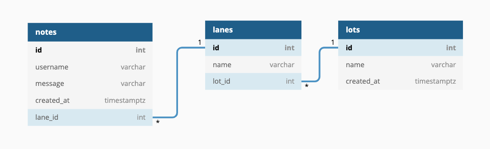

# Pursuit Parking Lot App

The Pursuit Parking Lot App is a Trello like website. Users can create parking lots (boards) add lanes (columns) and post sticky notes in parking lots about anything they want.

It is mainly intended to share questions or feedback. Feedback can be about a lesson or workshops, which makes a great classroom tool. It can also be used during panels or site visits to share and gather questions and feedback from an audience and have a live feed of that attendees are sharing. 

## Database Schema Diagram

