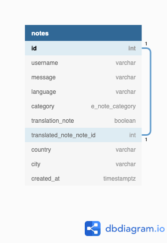

# Covidit.world

A website to share aspirations, reflections and appreciations through a post it note with the world.
There are three categories under which you can share a note, **Want to Do**, **Learned** & **Grateful For**.

## Intention
The effects of covid-19 have been felt throughout the world, such an impactful event has made us reflect about what we want to do after (and during) this pandemic, what we have learned about ourselves, the world and others, as well as, brought forefront the things we are and should be grateful for. We are already isolated and socially distanced, why should these reflections stay the same way? When they can inspire and help others while connecting us through language.

## Features
* Users are able to post a text only note in any category (Lessons Learned, Want to do, Grateful for) with a message in a chosen language and a name.
* A user is able to see all the notes that have even been shared in any of the categories
* A user is able to search notes by category, location and/or language. (Not note text content)
* Users can translate other users notes by hitting the translate button and submitting their translations

## Future features
* Pin a post it note to a location on a global map
* Users are able to collaborate and discuss a note translation, through messages attached to individual notes.

## Database Schema Diagram

## Client Pages

| Page                      | Description                                                           |
| ------------------------- | --------------------------------------------------------------------- |
| `/boards`                 | List a user's boards                                                  |
| `/boards/:id/:board_name` | Access a specific board by id and optional name for user friendliness |
